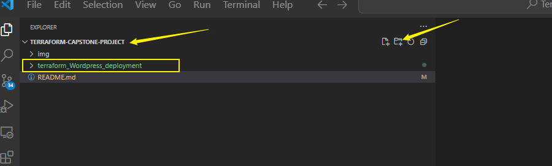
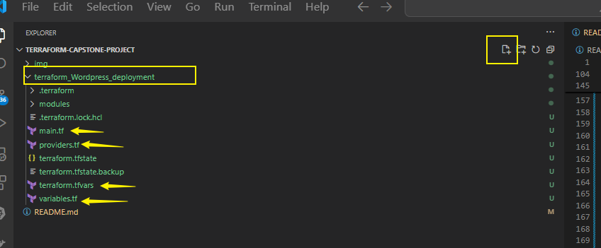
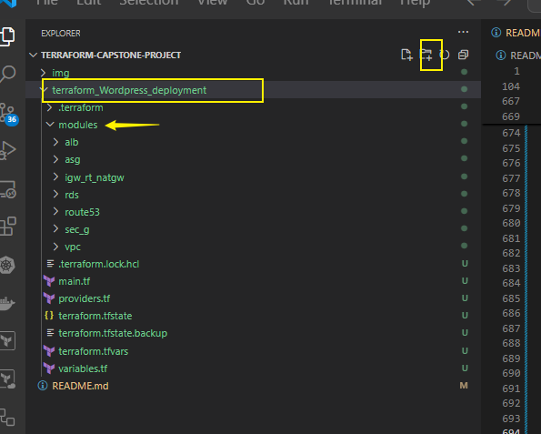
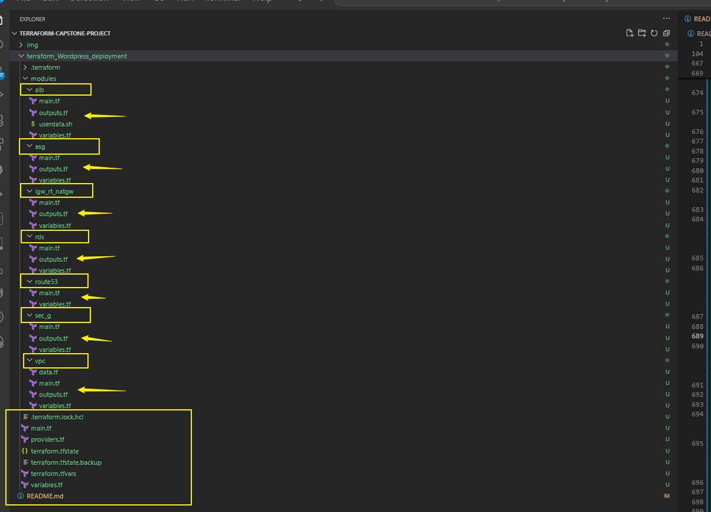
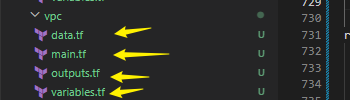

# Edward-okoto-Automated-Wordpress-Deployment-On-AWS

Automated Word-press Deployment On AWS TERRAFORM PROJECT

Project Objectives

1. VPC with public and private subnets in 2 availability zones
2. An Internet Gateway is used to allow communication between instances in VPC and the internet.
3. We are using 2 Availability zones for high availability and fault tolerance
4. Resources such as Nat gateway, Bastion Host, and application Load Balancer use Public subnets
5. Put webservers and database servers in the private subnets to protect them
6. The public Route Table is associated with the public subnets and routes traffic to the internet through the internet gateway
7. The main Route Table is associated with the private subnets.
8. The Nat Gateway allows the instances in the private App subnets and private Data subnets to access the internet.
9. We are using an MYSQL RDS database
10. We are using Amazon EFS so that the webservers can have access to shared files.
11. The EFS Mount Targets are in each AZ in the VPC
12. We are using EC2 Instances to host our website.
13. Application Load Balancer is used to distribute web traffic across an Auto Scaling Group of EC2 instances in multiple AZs
14. Using Auto Scaling Group to dynamically create our EC2 instances to make our website highly available,scalable,fault-tolerance, and elastic.
15. We are using Route 53 to register our Domain name and create a record set.

1. VPC Set-up
-VPC Architecture.

steps-
1.Define IP address range for the VPC
2. Create VPC with public and private subnets
3.Configure route tables for each subnet.

Instruction for Terraform
1. Use Terraform to define VPC, Subnets, and route tables.
2. Leverage variables for customization
3.Document terraform commands for execution

2.

Public and Private Subnet with NAT Gateway
- NAT gateway architecture
Steps-
1.Set up a public subnet for resources accessible from the internet
2.Create a private subnet for resources with no direct internet access
3. Configure a NAT Gateway for private subnet internet access

Instructions for Terraform

1. Utilize Terraform to define subnets, security groups and NAT Gateway
2. Ensure proper association of resources with corressponding subnets.
3. Documents Terraform commands for execution

3.AWS MySQL RDS setup
- Security Group Architecture

steps.
1.Create an Amazon RDS instance with the MySQL engine
2. Configure security groups for the RDS instance
3. Connect WordPress to the RDS database

Instruction for Terraform
1.Define Terraform scripts for RDS instance creation
2.Configure security groups and define necessary parameters
3.Document Terraform commands for execution


4.EFS Setup for WordPress Files

steps.
1.Create an EFS file system
2. Mount the EFS file system on WordPress instances.
3. Configure WordPress to use the shared file system

Instruction for Terraform
1.Define Terraform scripts for RDS instance creation
2.Configure security groups and define necessary parameters
3.Document Terraform commands for execution

5.Application Load Balancer

steps.
1.Create an Application Load Balancer.
2. Configure listener rules for routing traffic to instances
3. Integrate load Balancer with Auto Scaling group

Instruction for Terraform
1.Use Terraform to define Application Load Balancer configurations.
2. Integrate Load Balancer with Auto Scaling group
3.Document Terraform commands for execution


5.Auto Scaling Group

steps.
1.Create an Auto Scaling group
2. Define scaling policies based on metrics like CPU utilization
3. Configure launch configurations for instances

Instruction for Terraform
1. Develop Terraform script for Auto Scaling Group creation
2. Define scaling policies and launch configurations
3.Document Terraform commands for execution

### PROJECT IMPLEMENTATION

## Project File Structure

```
terraform-Wordpress-Deployment/
├── main.tf                    # Main configuration file for deploying resources
├── variables.tf               # Definitions of variables used throughout the project
├── terraform.tfvars           # Values assigned to the variables
├── providers.tf               # AWS provider configuration
├── module/                    # Directory containing all the Terraform modules
│   ├── vpc/                   # VPC module
│   │   ├── main.tf            # Configuration for creating the VPC
│   │   ├── variables.tf       # Variables used in the VPC module
│   │   ├── output.tf          # Outputs for the VPC module
│   ├── sec.g/                 # Security Group module
│   │   ├── main.tf            # Configuration for creating Security Groups
│   │   ├── variables.tf       # Variables used in the Security Group module
│   │   ├── output.tf          # Outputs for the Security Group module
│   ├── rds/                   # RDS (Database) module
│   │   ├── main.tf            # Configuration for creating the RDS instance
│   │   ├── variables.tf       # Variables used in the RDS module
│   │   ├── output.tf          # Outputs for the RDS module
│   ├── igw-rt-natgw/          # Internet Gateway, Route Table, NAT Gateway module
│   │   ├── main.tf            # Configuration for networking components
│   │   ├── variables.tf       # Variables used in this module
│   │   ├── output.tf          # Outputs for this module
│   ├── asg/                   # Auto Scaling Group module
│   │   ├── main.tf            # Configuration for creating the ASG
│   │   ├── variables.tf       # Variables used in the ASG module
│   │   ├── output.tf          # Outputs for the ASG module
│   ├── alb/                   # Application Load Balancer module
│   │   ├── main.tf            # Configuration for the ALB
│   │   ├── variables.tf       # Variables used in the ALB module
│   │   ├── output.tf          # Outputs for the ALB module
│   ├── route53/               # Route 53 module
│   │   ├── main.tf            # Configuration for Route 53
│   │   ├── variables.tf       # Variables used in the Route 53 module
│   │   ├── output.tf          # Outputs for the Route 53 module
```

---

### **File Structure Overview**

1. **Root Directory: `terraform-Wordpress-Deployment/`**
   - Contains all the core files for running and managing your Terraform project.
   - Files:
     - **`main.tf`**: Calls the modules and manages high-level orchestration.
     - **`variables.tf`**: Stores global variables used by the root configurations or passed to the modules.
     - **`terraform.tfvars`**: Provides concrete values for variables defined in `variables.tf`.
     - **`providers.tf`**: Specifies the AWS provider and any required configurations like the region.

2. **Module Directory: `module/`**
   - Each subdirectory (e.g., `vpc/`, `sec.g/`) corresponds to a module. Each module is self-contained and performs a specific task.

3. **Modules:**
   - **VPC (`vpc/`)**: Configures networking (e.g., VPC, subnets).
   - **Security Group (`sec.g/`)**: Manages access rules for resources like EC2 or RDS.
   - **RDS (`rds/`)**: Creates a managed database instance.
   - **Networking (`igw-rt-natgw/`)**: Handles Internet Gateways, Route Tables, and NAT Gateways.
   - **Auto Scaling Group (`asg/`)**: Sets up scalable EC2 instances.
   - **Load Balancer (`alb/`)**: Configures the ALB to distribute traffic.
   - **DNS (`route53/`)**: Manages domain name settings.

---

#### Create a root directory for the project
- Create a new branch called `feature` to work on the project

  `git branch -b feature`

- Create the root directory for the project and name it `terraform-Wordpress-deployment`  # Give it a name of your choice.


Instruction/direction

- ON the project directory,click on new folder and name it `terraform-Wordpress-deployment` # # Give it a name of your choice.

  OR (run the command on the project direction - Terraform-Capstone-Project)

  `mkdir terraform-Wordpress-deployment`

  


#### Create root files for the working/root directory (terraform-Wordpress-deployment)

- On the project root directory (terraform-Wordpress-deployment) create files `main.ft`, `providers.tf`, `variables.tf`, `terraform.tfvars` . 

Instruction/direction

- Click on the root directory and add these files root files (`main.ft`, `providers.tf`, `variables.tf`, `terraform.tfvars`)

  

#### Configure `providers.tf`
---

#### **File: `providers.tf`**

#### **1. Specify Required Providers**
```hcl
terraform {
  required_providers {
    aws = {
      source  = "hashicorp/aws"
      version = "5.94.1"
    }
  }
}
```

**Explanation**:
- **`required_providers`**: Declares which provider(s) Terraform will use. In this case, you're using the `hashicorp/aws` provider.
- **`version`**: Specifies the version of the AWS provider. Version `5.94.1` ensures compatibility and avoids unexpected changes from newer versions.

---

#### **2. Configure the AWS Provider**
```hcl
provider "aws" {
  region  = "us-east-1"
  profile = "Terraform-user"
}
```

**Explanation**:
- **`provider "aws"`**: Configures Terraform to interact with AWS resources.
- **`region`**: Specifies the AWS region (`us-east-1`) where resources will be created.
- **`profile`**: Refers to the AWS CLI profile named `Terraform-user` for credentials and access details.

---

#### **3. S3 Bucket for Terraform State**
```hcl
resource "aws_s3_bucket" "terraform_state" {
  bucket = "edwardokotobuckethouse2"

  tags = {
    Name        = "Terraform State Bucket"
    Environment = "Development"
  }
}
```

**Explanation**:
- **S3 Bucket**: This bucket is used to store the Terraform state file. Storing the state remotely ensures collaboration and persistence.
- **`bucket`**: Defines the unique name of your S3 bucket (`edwardokotobuckethouse2`).
- **Tags**:
  - **`Name`**: Identifies the purpose of the bucket.
  - **`Environment`**: Helps distinguish between environments (e.g., development, production).

---

#### **4. DynamoDB Table for State Locking**
```hcl
resource "aws_dynamodb_table" "terraform_lock" {
  name         = "terraform-state-lock"
  billing_mode = "PAY_PER_REQUEST"
  hash_key     = "LockID"

  attribute {
    name = "LockID"
    type = "S"
  }

  tags = {
    Name        = "Terraform State Lock Table"
    Environment = "Development"
  }
}
```

**Explanation**:
- **DynamoDB Table**: Used for Terraform state locking to prevent simultaneous writes from multiple users.
- **`name`**: The table's name (`terraform-state-lock`).
- **`billing_mode`**: Set to `PAY_PER_REQUEST`, which means you're only charged for read/write requests.
- **`hash_key`**: The primary key for the table (here, `LockID`).
- **Attribute**:
  - **`name`**: The name of the primary key.
  - **`type`**: `S` stands for a string attribute type.
- **Tags**:
  - **`Name`**: Identifies the table's purpose.
  - **`Environment`**: Specifies the environment type.

---

- Run the commands 
  `terraform init` and `terrorm apply`

  ```
  terraform init
  terraform apply
  ```

#### **5. Configure the Terraform Backend**
```hcl
terraform {
  backend "s3" {
    bucket         = "edwardokotobuckethouse1"
    key            = "edwardokotobuckethouse1/terraform/terraform.tfstate"
    region         = "us-east-1"
    dynamodb_table = "terraform-state-lock"
    encrypt        = true
    profile        = "Terraform-user"
  }
}
```

##### Initialize the Backend

- Run the commands 
  `terraform init` and `terrorm apply`

  ```
  terraform init
  terraform apply
  ```

**Explanation**:
- **Backend Configuration**: Defines how Terraform manages its state file.
  - **`bucket`**: Specifies the S3 bucket (`edwardokotobuckethouse1`) where the state file is stored.
  - **`key`**: The path to the state file within the bucket.
  - **`region`**: Specifies the AWS region for the bucket.
  - **`dynamodb_table`**: Indicates the DynamoDB table (`terraform-state-lock`) used for state locking.
  - **`encrypt`**: Ensures that the state file is encrypted for security.
  - **`profile`**: Uses the AWS CLI profile (`Terraform-user`) for authentication.

---

#### **Key Points**
- **State Management**:
  - The S3 bucket and DynamoDB table ensure a remote, reliable, and secure mechanism for managing the Terraform state.
  - State locking with DynamoDB avoids conflicts when multiple users or automation processes work on the same Terraform workspace.
- **Separation of Concerns**:
  - This configuration maintains the state management logic separate from the actual resource configurations, simplifying the overall structure.
- **Reusability and Security**:
  - Using the `profile` ensures credentials are securely managed by the AWS CLI.
  - Encryption of the state file protects sensitive information.

---

#### **Test on providers.tf file**
1. Ensure that the S3 bucket (`edwardokotobuckethouse1`) is created successfully.
2. Confirm that the DynamoDB table (`terraform-state-lock`) is configured correctly and visible in the AWS Management Console.
3. Verify state locking by attempting to run simultaneous `terraform apply` commands—only one should proceed, while the other waits.

---

#### Configure the `main.tf`

---

#### **File: `main.tf`**

#### **Overview**
The `main.tf` file defines how each module in your project is interconnected. Each module is responsible for creating specific AWS resources, ensuring modularity, reusability, and maintainability of your Terraform code.

---

#### **1. VPC Module**
```hcl
module "vpc" {
  source               = "./modules/vpc"
  vpc_cidr             = var.vpc_cidr
  public_subnets       = var.public_subnets
  private_subnets      = var.private_subnets
  public_subnet_names  = var.public_subnet_names
  private_subnet_names = var.private_subnet_names
}
```

**Explanation**:
- **Source**: Points to the `vpc` module directory (`./modules/vpc`).
- **Inputs**:
  - `vpc_cidr`: The CIDR block for the VPC (e.g., `10.0.0.0/16`).
  - `public_subnets` and `private_subnets`: Lists of CIDR blocks for the subnets.
  - `public_subnet_names` and `private_subnet_names`: Tags/names for the subnets.
- **Output Usage**: Other modules (e.g., `igw_rt_natgw`, `alb`, `asg`) depend on this module for VPC IDs and subnet information.

---

#### **2. Internet Gateway, Route Table, and NAT Gateway Module**
```hcl
module "igw_rt_natgw" {
  source             = "./modules/igw_rt_natgw"
  vpc_id             = module.vpc.vpc_id
  public_subnet_ids  = module.vpc.public_subnet_ids
  private_subnet_ids = module.vpc.private_subnet_ids
}
```

**Explanation**:
- **Source**: Points to the `igw_rt_natgw` module.
- **Inputs**:
  - `vpc_id`: The ID of the VPC (output from the `vpc` module).
  - `public_subnet_ids` and `private_subnet_ids`: IDs of public and private subnets from the `vpc` module.
- **Purpose**:
  - Creates the Internet Gateway for public subnets.
  - Configures route tables for public and private subnets.
  - Sets up a NAT Gateway to allow private subnets to access the internet securely.

---

#### **3. Security Group Module**
```hcl
module "sec_g" {
  source = "./modules/sec_g"
  vpc_id = module.vpc.vpc_id
}
```

**Explanation**:
- **Source**: Points to the `sec_g` module.
- **Inputs**:
  - `vpc_id`: The ID of the VPC where the security groups will be created.
- **Purpose**:
  - Manages security groups to define traffic rules for resources like EC2 instances, ALB, and RDS.

---

#### **4. Auto Scaling Group (ASG) Module**
```hcl
module "asg" {
  source             = "./modules/asg"
  alb-ec2-tg         = module.alb.alb-ec2-tg
  private_subnet_ids = module.vpc.private_subnet_ids
  launch-template    = module.alb.launch-template
}
```

**Explanation**:
- **Source**: Points to the `asg` module.
- **Inputs**:
  - `alb-ec2-tg`: ALB target group output from the `alb` module.
  - `private_subnet_ids`: Subnets where the Auto Scaling Group will deploy instances.
  - `launch-template`: The launch template for provisioning EC2 instances (output from the `alb` module).
- **Purpose**:
  - Sets up an Auto Scaling Group to automatically scale EC2 instances based on traffic or resource usage.

---

#### **5. Application Load Balancer (ALB) Module**
```hcl
module "alb" {
  source               = "./modules/alb"
  alb_sg               = module.sec_g.alb_sg
  public_subnet_ids    = module.vpc.public_subnet_ids
  aws_internet_gateway = module.igw_rt_natgw.aws_internet_gateway
  vpc_id               = module.vpc.vpc_id
  ec2_sg_sg            = module.sec_g.ec2_sg_sg
}
```

**Explanation**:
- **Source**: Points to the `alb` module.
- **Inputs**:
  - `alb_sg`: Security group for the ALB, from the `sec_g` module.
  - `public_subnet_ids`: Subnets for the ALB to route traffic.
  - `aws_internet_gateway`: Internet Gateway for ALB traffic.
  - `vpc_id`: The VPC ID where the ALB is deployed.
  - `ec2_sg_sg`: Security group for the EC2 instances.
- **Purpose**:
  - Sets up an Application Load Balancer for distributing traffic to EC2 instances.

---

#### **6. RDS (Relational Database Service) Module**
```hcl
module "rds" {
  source             = "./modules/rds"
  private_subnet_ids = module.vpc.private_subnet_ids
  rds_sg_id          = module.sec_g.rds_sg_id
  db_name            = var.db_name
  db_username        = var.db_username
  db_password        = var.db_password
}
```

**Explanation**:
- **Source**: Points to the `rds` module.
- **Inputs**:
  - `private_subnet_ids`: Deploys the RDS instance in private subnets.
  - `rds_sg_id`: Security group ID for the RDS instance.
  - `db_name`, `db_username`, `db_password`: Database credentials passed as variables.
- **Purpose**:
  - Deploys a managed MySQL RDS instance in private subnets with secure access.

---

#### **7. Route 53 Module**
```hcl
module "route53" {
  source      = "./modules/route53"
  domain_name = var.domain_name
  record_name = var.record_name
  aws_lb_dns  = module.alb.aws_lb_dns
  aws_lb_zone = module.alb.aws_lb_zone
}
```

**Explanation**:
- **Source**: Points to the `route53` module.
- **Inputs**:
  - `domain_name`: The custom domain name for your website.
  - `record_name`: The subdomain or record to point traffic to.
  - `aws_lb_dns`: The DNS name of the ALB to point traffic to.
  - `aws_lb_zone`: The hosted zone ID of the ALB.
- **Purpose**:
  - Configures DNS settings to route traffic to your ALB using Route 53.

---

#### **What to Test in `main.tf`**
1. **Module Connectivity**:
   - Ensure that each module references the correct output values from other modules.
   - Test that the dependent modules are initialized in the correct order.
2. **Input and Output Validation**:
   - Verify that all variables and outputs are correctly passed between modules.
3. **Infrastructure Deployment**:
   - Run `terraform plan` and `terraform apply` to confirm that all resources are successfully created.

---

#### Configure the `variables.tf`
---

#### **Purpose of `variables.tf`**
This file defines all the input variables used across the project. Variables make the Terraform configuration reusable, flexible, and easier to manage by abstracting hardcoded values. Instead of directly specifying values in your Terraform modules or resources, you pass them as inputs.

---

#### **Variable Definitions**

#### **1. VPC CIDR Block**
```hcl
variable "vpc_cidr" {
  description = "VPC CIDR Block"
  type        = string
}
```
- **Purpose**: Represents the CIDR block for your Virtual Private Cloud (VPC). This defines the range of IP addresses the VPC will manage.
- **Example Value**: `"10.0.0.0/16"`

---

#### **2. Public Subnets**
```hcl
variable "public_subnets" {
  description = "Cidr for public subnets"
  type        = list(string)
}
```
- **Purpose**: A list of CIDR blocks assigned to public subnets within the VPC.
- **Example Value**: `["10.0.1.0/24", "10.0.2.0/24"]`

---

#### **3. Private Subnets**
```hcl
variable "private_subnets" {
  description = "Cidr for public subnet 1b"
  type        = list(string)
}
```
- **Purpose**: A list of CIDR blocks assigned to private subnets within the VPC.
- **Example Value**: `["10.0.3.0/24", "10.0.4.0/24"]`

---

#### **4. Public Subnet Names**
```hcl
variable "public_subnet_names" {
  description = "public subnet names"
  type        = list(string)
}
```
- **Purpose**: Names for tagging the public subnets to make them identifiable in the AWS console.
- **Example Value**: `["Public-Subnet-1", "Public-Subnet-2"]`

---

#### **5. Private Subnet Names**
```hcl
variable "private_subnet_names" {
  description = "private subnet names"
  type        = list(string)
}
```
- **Purpose**: Names for tagging the private subnets for identification in the AWS console.
- **Example Value**: `["Private-Subnet-1", "Private-Subnet-2"]`

---

#### **6. Database Name**
```hcl
variable "db_name" {
  description = "Name of the database"
  type        = string
}
```
- **Purpose**: Specifies the name of the database to be created in the RDS instance.
- **Example Value**: `"wordpress_db"`

---

#### **7. Database Username**
```hcl
variable "db_username" {
  description = "Database admin username"
  type        = string
}
```
- **Purpose**: The username for the RDS database administrator.
- **Example Value**: `"admin"`

---

#### **8. Database Password**
```hcl
variable "db_password" {
  description = "Database admin password"
  type        = string
}
```
- **Purpose**: The password for the RDS database administrator.
- **Example Value**: `"securepassword123"`

---

#### **9. Domain Name**
```hcl
variable "domain_name" {
  description = "domain-name"
  default     = "invincible-cham.co.uk"
  type        = string
}
```
- **Purpose**: Represents the custom domain name used for Route 53 and other DNS configurations.
- **Default Value**: `"invincible-cham.co.uk"`
- **Explanation**: If no value is provided in `terraform.tfvars`, the default value (`invincible-cham.co.uk`) will be used.

---

#### **10. Record Name**
```hcl
variable "record_name" {
  description = "sub-domain-name"
  default     = "www."
  type        = string
}
```
- **Purpose**: Represents the subdomain name used for Route 53 DNS records.
- **Default Value**: `"www."`
- **Example Usage**: Creates a DNS record like `www.invincible-cham.co.uk`.

---

#### **How This File Fits in the Project**
1. **Inputs for Modules**: The variables in this file are passed to various modules (like VPC, RDS, Route 53) in the `main.tf` file using `var.<variable_name>`.
2. **Flexibility**: By defining variables, you can easily switch configurations (e.g., deploy to a different region or use different subnet CIDRs) without modifying the main configuration files.

---

#### **How to Use Variables**
You need to assign values to these variables in your `terraform.tfvars` file or pass them directly during execution.
#### **`terraform.tfvars`**
```
vpc_cidr             = "10.0.0.0/16"
public_subnets       = ["10.0.1.0/24", "10.0.2.0/24"]
private_subnets      = ["10.0.3.0/24", "10.0.4.0/24"]
public_subnet_names  = ["PublicSubnet1", "PublicSubnet2"]
private_subnet_names = ["PrivateSubnet1", "PrivateSubnet2"]
db_name              = "Wordpress_db"

```

---

#### Modularize the rest of the project!!

NB - The root main.tf,variables.tf was configured from the various modules that will be explained herein.

 Create a directory called `modules` - Inside `the modules` directory,create `vpc`,`sec-g`,`route53`,`rds`,`igw_rt_natgw`,`asg` andd `alb` directories

 

 Create in each of these directories, a `main.tf` `variables.tf` and `outputs.tf` according to the project structure !

 Instruction/direction

 - Select the root directory,then click `New folder` and create the folders above.
 -Similarly select the various folders and click on `New file` ,create the files above for the various directories.

 

 OR (Use TERMINAL-From the root directory `terraform-Wordpress-deployment` )

 ```
 mkdir modules
 cd modules
 mkdir vpc sec-g route53 rds igw_rt_natgw asg alb
 cd vpc
 touch main.tf variables.tf outputs.tf
 cd ../sec-g
 touch main.tf variables.tf outputs.tf
 cd ../route53
 touch main.tf variables.tf outputs.tf
 cd ../rds
 touch main.tf variables.tf outputs.tf
 cd ../igw_rt_natgw
 touch main.tf variables.tf outputs.tf
 cd ../asg
 touch main.tf variables.tf outputs.tf
 cd ../alb
 touch main.tf variables.tf outputs.tf
 ```

#### Configure the various files to purpose!!

PLEASE USE AWS DOCUMENTATION FOR GUIDIANCE

`vpc module`



`main.tf`
---

#### **File: `main.tf` (VPC Module)**

This file is responsible for creating the **Virtual Private Cloud (VPC)**, as well as its **public and private subnets**. It also ensures proper tagging and configuration of these resources for networking purposes.

---

#### **1. VPC Creation**
```hcl
resource "aws_vpc" "vpc-dev" {
  cidr_block           = var.vpc_cidr
  instance_tenancy     = "default"
  enable_dns_support   = true
  enable_dns_hostnames = true

  tags = {
    Name = "vpc-dev"
  }
}
```

**Explanation**:
- **Resource Type**: `aws_vpc` creates a VPC in AWS.
- **`cidr_block`**: Defines the IP address range for the VPC (provided dynamically via `var.vpc_cidr`).
  - Example Value: `10.0.0.0/16`
- **`instance_tenancy`**: Default instance tenancy allows shared hardware tenancy for EC2 instances (cost-efficient).
- **`enable_dns_support`**: Ensures DNS resolution is supported for instances in this VPC.
- **`enable_dns_hostnames`**: Enables instances in this VPC to have DNS hostnames.
- **Tags**:
  - **`Name`**: Labels the VPC with `vpc-dev` for easy identification in the AWS console.

---

#### **2. Public Subnets**
```hcl
resource "aws_subnet" "public_subnets" {
  vpc_id                     = aws_vpc.vpc-dev.id
  cidr_block                 = var.public_subnets[count.index]
  availability_zone          = data.aws_availability_zones.availability_zones.names[count.index]
  map_public_ip_on_launch    = true
  count                      = length(var.public_subnets)

  tags = {
    Name = var.public_subnet_names[count.index]
  }
}
```

**Explanation**:
- **Resource Type**: `aws_subnet` creates public subnets within the VPC.
- **`vpc_id`**: Links the subnets to the VPC created earlier (`aws_vpc.vpc-dev.id`).
- **`cidr_block`**: Assigns CIDR blocks dynamically from `var.public_subnets`.
  - Example Value: `["10.0.1.0/24", "10.0.2.0/24"]`
- **`availability_zone`**: Maps each subnet to a specific availability zone.
  - Dynamically fetched using `data.aws_availability_zones`.
- **`map_public_ip_on_launch`**: Ensures that instances launched in these subnets automatically receive public IP addresses.
- **`count`**: Dynamically creates one subnet per CIDR block provided in `var.public_subnets`.
- **Tags**:
  - **`Name`**: Assigns names to each public subnet dynamically from `var.public_subnet_names`.
  - Example Value: `["Public-Subnet-1", "Public-Subnet-2"]`

---

#### **3. Private Subnets**
```hcl
resource "aws_subnet" "private_subnets" {
  vpc_id                     = aws_vpc.vpc-dev.id
  cidr_block                 = var.private_subnets[count.index]
  availability_zone          = data.aws_availability_zones.availability_zones.names[count.index]
  map_public_ip_on_launch    = false
  count                      = length(var.private_subnets)

  tags = {
    Name = var.private_subnet_names[count.index]
  }
}
```

**Explanation**:
- **Resource Type**: `aws_subnet` creates private subnets in the VPC.
- **`vpc_id`**: Links the subnets to the VPC (`aws_vpc.vpc-dev.id`).
- **`cidr_block`**: Assigns CIDR blocks dynamically from `var.private_subnets`.
  - Example Value: `["10.0.3.0/24", "10.0.4.0/24"]`
- **`availability_zone`**: Maps each private subnet to a specific availability zone.
  - Dynamically fetched using `data.aws_availability_zones`.
- **`map_public_ip_on_launch`**: Prevents private instances from receiving public IPs.
- **`count`**: Dynamically creates one private subnet per CIDR block provided in `var.private_subnets`.
- **Tags**:
  - **`Name`**: Assigns names to private subnets dynamically from `var.private_subnet_names`.
  - Example Value: `["Private-Subnet-1", "Private-Subnet-2"]`

---

#### **Supporting Data Source**

The `availability_zone` attribute references this data source:
```hcl
data "aws_availability_zones" "availability_zones" {
  state = "available"
}
```

- **Purpose**: Fetches all available availability zones in the specified AWS region.
- **Usage**: Ensures subnets are distributed across availability zones dynamically using `data.aws_availability_zones.availability_zones.names`.

---

#### **Key Points for Testing and Validation**
1. **VPC Creation**:
   - Ensure the VPC is created with the correct CIDR block (e.g., `10.0.0.0/16`).
   - Confirm that DNS support and DNS hostnames are enabled in the AWS Management Console.

2. **Subnet Configuration**:
   - Verify public and private subnets have the correct CIDR blocks.
   - Check that public subnets are assigned public IPs and private subnets are not.
   - Confirm each subnet is tagged with the correct name.

3. **Availability Zones**:
   - Ensure subnets are evenly distributed across availability zones.
   - Validate that the `availability_zone` attribute matches the AWS region.

---
`variables.tf`
---

#### **File: `variables.tf` (VPC Module)**

This file defines the variables required for configuring the VPC and its associated subnets. It ensures flexibility by allowing different CIDR ranges, subnet configurations, and naming conventions for public and private subnets.

---

#### **1. VPC CIDR Block**
```hcl
variable "vpc_cidr" {
  description = "VPC CIDR Block"
  type        = string
}
```
- **Purpose**: Specifies the IP address range for the entire VPC.
- **Type**: A single string representing the CIDR block (e.g., `10.0.0.0/16`).
- **Usage**: This variable is referenced in the `aws_vpc` resource to define the VPC’s address space.

---

#### **2. Public Subnet CIDR Blocks**
```hcl
variable "public_subnets" {
  description = "Cidr for public subnets"
  type        = list(string)
}
```
- **Purpose**: A list of CIDR blocks to allocate for public subnets in the VPC.
- **Type**: A list of strings (each string is a CIDR block, e.g., `["10.0.1.0/24", "10.0.2.0/24"]`).
- **Usage**: Used dynamically in the `aws_subnet` resource to create multiple public subnets, each with its own CIDR range.

---

#### **3. Private Subnet CIDR Blocks**
```hcl
variable "private_subnets" {
  description = "Cidr for public subnet 1b"
  type        = list(string)
}
```
- **Purpose**: A list of CIDR blocks to allocate for private subnets in the VPC.
- **Type**: A list of strings (e.g., `["10.0.3.0/24", "10.0.4.0/24"]`).
- **Usage**: Passed to the `aws_subnet` resource for dynamically creating private subnets, ensuring no public IPs are assigned.

---

#### **4. Public Subnet Names**
```hcl
variable "public_subnet_names" {
  description = "public subnet names"
  type        = list(string)
}
```
- **Purpose**: Provides a list of names to tag public subnets for easier identification.
- **Type**: A list of strings (e.g., `["Public-Subnet-1", "Public-Subnet-2"]`).
- **Usage**: Used in the `aws_subnet` resource to tag each public subnet with a unique name.

---

#### **5. Private Subnet Names**
```hcl
variable "private_subnet_names" {
  description = "private subnet names"
  type        = list(string)
}
```
- **Purpose**: Provides a list of names to tag private subnets for easier identification.
- **Type**: A list of strings (e.g., `["Private-Subnet-1", "Private-Subnet-2"]`).
- **Usage**: Applied as tags to private subnets in the `aws_subnet` resource, making it easier to identify them in the AWS console.

---

#### **How This File Fits into the VPC Module**
- **Dynamic Subnet Creation**: The `public_subnets` and `private_subnets` variables ensure that subnet creation is scalable, allowing for as many subnets as required.
- **Custom Tags**: The `public_subnet_names` and `private_subnet_names` make it easy to manage and identify subnets in the AWS console.
- **Reusability**: This modular approach allows you to reconfigure the VPC by simply modifying input values for different environments (e.g., staging, production).

---
`outputs.tf`
---

#### **File: `output.tf` (VPC Module)**

This file defines the outputs of the VPC module. Outputs are used to pass essential information (like resource IDs) from one module to another. They make the module reusable and help share key information with the root module or other modules.

---

#### **1. VPC ID**
```hcl
output "vpc_id" {
  description = "VPC ID"
  value       = aws_vpc.vpc-dev.id
}
```
- **Purpose**:
  - Exposes the ID of the VPC created within this module.
  - Other modules (e.g., security groups, subnets, and networking components) rely on this output to associate their resources with the correct VPC.
- **Usage**:
  - Referenced in the root `main.tf` file using:
    ```hcl
    module.vpc.vpc_id
    ```

---

#### **2. Public Subnet IDs**
```hcl
output "public_subnet_ids" {
  value = aws_subnet.public_subnets.*.id
}
```
- **Purpose**:
  - Provides a list of IDs for all public subnets created within the VPC module.
  - Used by other modules (e.g., the application load balancer (ALB) or NAT gateway) to route public traffic.
- **Usage**:
  - Referenced in the root `main.tf` file using:
    ```hcl
    module.vpc.public_subnet_ids
    ```
- **Explanation of `aws_subnet.public_subnets.*.id`**:
  - The `*` operator iterates through all `public_subnets` resources and extracts their IDs into a list.

---

#### **3. Private Subnet IDs**
```hcl
output "private_subnet_ids" {
  value = aws_subnet.private_subnets.*.id
}
```
- **Purpose**:
  - Provides a list of IDs for all private subnets created within the VPC module.
  - Required by other modules (e.g., RDS or Auto Scaling Groups) to ensure resources are placed in private subnets.
- **Usage**:
  - Referenced in the root `main.tf` file using:
    ```hcl
    module.vpc.private_subnet_ids
    ```
- **Explanation of `aws_subnet.private_subnets.*.id`**:
  - Similar to `public_subnet_ids`, it collects IDs for all private subnets dynamically using the `*` operator.

---

#### **How This Fits into the Overall Project**
- These outputs ensure **inter-module communication**, making the VPC module independent yet integrable with other modules like `sec_g`, `alb`, `rds`, etc.
- By outputting essential information like IDs, you can dynamically reference resources across modules without hardcoding values.

---

#### **Best Practices**
1. **Descriptive Names**:
   - Use clear output names like `vpc_id`, `public_subnet_ids`, and `private_subnet_ids` to make the code readable and easy to debug.
2. **Descriptions**:
   - Include meaningful descriptions for each output to ensure other contributors understand their purpose.
3. **Testing**:
   - Run `terraform output` after deploying the infrastructure to verify that the outputs return the correct values.

---
`Security Group Module`
 (`sec_g`)
---
#### **Security Group Module**

This module is responsible for creating security groups to control inbound and outbound traffic to AWS resources like the Application Load Balancer (ALB), EC2 instances, and the RDS database.

---
`main.tf`
#### **1. Security Group for ALB**
```hcl
# Security group for ALB (Internet => ALB)
resource "aws_security_group" "alb_sg" {
  name        = "alb-security-group"                  # Name of the security group
  description = "Allow HTTP, SSH inbound traffic"     # Description of the purpose of this security group
  vpc_id      = var.vpc_id                            # VPC ID where this security group will be created

  # Allow HTTP traffic (port 80) from any source
  ingress {
    description = "HTTP"
    from_port   = 80                                  # Starting port (HTTP)
    to_port     = 80                                  # Ending port (HTTP)
    protocol    = "tcp"                               # Protocol (TCP)
    cidr_blocks = ["0.0.0.0/0"]                       # Open to the world (not recommended for production)
  }

  # Allow SSH traffic (port 22) from any source
  ingress {
    description = "SSH"
    from_port   = 22                                  # Starting port (SSH)
    to_port     = 22                                  # Ending port (SSH)
    protocol    = "tcp"                               # Protocol (TCP)
    cidr_blocks = ["0.0.0.0/0"]                       # Open to the world (not recommended for production)
  }

  # Allow all outbound traffic
  egress {
    from_port   = 0                                   # Starting port
    to_port     = 0                                   # Ending port
    protocol    = "-1"                                # All protocols
    cidr_blocks = ["0.0.0.0/0"]                       # Open to the world
  }

  tags = {
    Name = "my-alb-sg"                                # Tag to identify this security group
  }
}
```

**Explanation**:
- **Purpose**: This security group allows inbound HTTP and SSH traffic from the internet to the ALB and unrestricted outbound traffic.
- **Use Case**: It is assigned to the ALB to allow user traffic and admin access for configuration.

---

#### **2. Security Group for EC2 Instances**
```hcl
# Security group for EC2 instances (ALB => EC2)
resource "aws_security_group" "ec2_sg" {
  name        = "ec2-security-group"                  # Name of the security group
  description = "Allow HTTP, SSH inbound traffic"     # Description of the purpose of this security group
  vpc_id      = var.vpc_id                            # VPC ID where this security group will be created

  # Allow all traffic from ALB's security group
  ingress {
    description      = "Allows traffic only from ALB"
    from_port        = 0                               # Starting port
    to_port          = 0                               # Ending port
    protocol         = "-1"                            # All protocols
    security_groups  = [aws_security_group.alb_sg.id]  # Allow traffic only from ALB security group
  }

  # Allow all outbound traffic
  egress {
    from_port   = 0                                   # Starting port
    to_port     = 0                                   # Ending port
    protocol    = "-1"                                # All protocols
    cidr_blocks = ["0.0.0.0/0"]                       # Open to the world
  }

  tags = {
    Name = "my-ec2-sg"                                # Tag to identify this security group
  }
}
```

**Explanation**:
- **Purpose**: This security group allows traffic only from the ALB security group (`alb_sg`).
- **Use Case**: It is assigned to EC2 instances running the application to restrict access to only those requests routed through the ALB.

---

#### **3. Security Group for RDS**
```hcl
# Security group for RDS (EC2 => RDS)
resource "aws_security_group" "rds_sg" {
  name        = "rds-security-group"                  # Name of the security group
  description = "Allow MySQL access from EC2 instances" # Description of the purpose of this security group
  vpc_id      = var.vpc_id                            # VPC ID where this security group will be created

  # Allow MySQL traffic from EC2 instances
  ingress {
    description      = "Allow MySQL traffic"
    from_port        = 3306                           # MySQL port
    to_port          = 3306                           # MySQL port
    protocol         = "tcp"                          # Protocol (TCP)
    security_groups  = [aws_security_group.ec2_sg.id] # Allow traffic only from EC2 security group
  }

  # Allow all outbound traffic
  egress {
    description = "Allow all outbound traffic"
    from_port   = 0                                   # Starting port
    to_port     = 0                                   # Ending port
    protocol    = "-1"                                # All protocols
    cidr_blocks = ["0.0.0.0/0"]                       # Open to the world
  }

  tags = {
    Name = "RDS Security Group"                      # Tag to identify this security group
  }
}
```

**Explanation**:
- **Purpose**: This security group allows MySQL traffic from EC2 instances to the RDS database and unrestricted outbound traffic.
- **Use Case**: It is assigned to the RDS instance to restrict access to only the EC2 instances running the application.

---

### **How This Module Fits**
1. **ALB Security Group**:
   - Allows inbound internet traffic and forwards it to the EC2 instances.

2. **EC2 Security Group**:
   - Restricts traffic to only those requests routed through the ALB, ensuring secure communication.

3. **RDS Security Group**:
   - Controls database access, allowing only EC2 instances to communicate with the RDS database.

---

### **Best Practices**
- **Restrict CIDR Blocks**: Avoid using `0.0.0.0/0` in production environments; instead, restrict access to trusted IP ranges.
- **Tagging**: Tags are helpful for organizing and identifying resources in the AWS console.
- **Environment Separation**: Use different security groups for staging, testing, and production environments to maintain isolation.

---
`variables.tf`
#### **Variable: `vpc_id`**
```hcl
variable "vpc_id" {
  description = "vpc ID for security-groups"
  type        = string
}
```

---

#### **Purpose**
- **`vpc_id`**: This variable is used to pass the ID of the Virtual Private Cloud (VPC) to the security group module. It ensures that the security groups are created in the correct VPC.

---

#### **Usage**
In the security group module, this variable is referenced as follows:
```hcl
vpc_id = var.vpc_id
```
This binds the security groups to the specific VPC indicated by the value of `vpc_id`.


---

When calling the security group module in the root `main.tf`, you can pass the value dynamically from the VPC module:
```hcl
module "sec_g" {
  source = "./modules/sec_g"
  vpc_id = module.vpc.vpc_id
}
```
Here, the `vpc_id` value is derived from the output of the VPC module (`module.vpc.vpc_id`).

---
`outputs.tf`

---

#### **File: `output.tf` (Security Group Module)**

This file defines the outputs for the security group module. Outputs allow other modules to reference essential properties of the security groups, such as their IDs, ensuring seamless interconnectivity between modules.

---

#### **1. ALB Security Group ID**
```hcl
output "alb_sg" {
  description = "alb-sg ID"
  value       = aws_security_group.alb_sg.id
}
```
- **Purpose**:
  - Exposes the ID of the ALB security group (`alb_sg`) created in this module.
  - Used by other modules (e.g., the ALB module itself or EC2 module) to associate resources with the ALB security group.
- **Usage**:
  - Referenced in the root `main.tf` file as:
    ```hcl
    module.sec_g.alb_sg
    ```

---

#### **2. EC2 Security Group ID**
```hcl
output "ec2_sg_sg" {
  description = "ec2-sg ID"
  value       = aws_security_group.ec2_sg.id
}
```
- **Purpose**:
  - Provides the ID of the EC2 security group (`ec2_sg`) created in this module.
  - Used to allow communication between EC2 instances and other resources (e.g., ALB, RDS).
- **Usage**:
  - Referenced in the root `main.tf` file as:
    ```hcl
    module.sec_g.ec2_sg_sg
    ```

---

#### **3. RDS Security Group ID**
```hcl
output "rds_sg_id" {
  description = "rds-sg-ID"
  value       = aws_security_group.rds_sg.id
}
```
- **Purpose**:
  - Exposes the ID of the RDS security group (`rds_sg`) created in this module.
  - Allows other modules (e.g., the RDS module) to reference the RDS security group for database communication and restricted access.
- **Usage**:
  - Referenced in the root `main.tf` file as:
    ```hcl
    module.sec_g.rds_sg_id
    ```

---

### **Why Outputs Are Essential**
1. **Inter-module Communication**:
   - Outputs enable modular, reusable code by passing resource-specific information (like security group IDs) to other modules or resources.
2. **Dynamic Resource Linking**:
   - Security group IDs are required to link AWS resources such as EC2, ALB, and RDS. Hardcoding IDs is impractical, so outputs dynamically provide this information.
3. **Scalability**:
   - Outputs make your Terraform project easier to adapt for different environments (e.g., staging vs. production).

---

### **Best Practices**
- **Descriptions**:
  - Always include clear and concise descriptions for outputs so other developers understand their purpose.
- **Validation**:
  - Run `terraform output` after deploying the module to ensure that the expected values are returned.


---
`RDS Module`
---

This module creates the database infrastructure by defining a **subnet group** for the database and provisioning a **MySQL RDS instance** with high availability.

---
`main.tf`

#### **1. Database Subnet Group**
```hcl
resource "aws_db_subnet_group" "private_db_subnet_group" {
  name       = "private-db-subnet-group"        # Name of the DB subnet group
  subnet_ids = var.private_subnet_ids           # List of private subnet IDs to associate with the RDS instance

  tags = {
    Name = "Private DB Subnet Group"            # Tag for identifying the DB subnet group
  }
}
```

**Explanation**:
- **Resource Type**: `aws_db_subnet_group` groups subnets for RDS instances, ensuring that the database is deployed in private subnets.
- **Inputs**:
  - `name`: A unique name for the subnet group.
  - `subnet_ids`: Dynamically references the IDs of private subnets passed via `var.private_subnet_ids`.
- **Purpose**:
  - Defines the private network configuration for the RDS instance. RDS will use this subnet group to restrict database access to private subnets only.
- **Tags**: Helps identify and organize the subnet group in AWS.

---

#### **2. RDS Instance**
```hcl
resource "aws_db_instance" "mysql_rds" {
  identifier              = "mysql-rds-instance"                # Unique name for the RDS instance
  engine                  = "mysql"                             # Specifies MySQL as the database engine
  engine_version          = "8.0"                               # MySQL version
  instance_class          = "db.t3.micro"                       # Specifies the compute capacity of the instance
  allocated_storage       = 20                                  # Storage size for the database (in GB)
  db_name                 = var.db_name                         # Name of the database
  username                = var.db_username                     # Admin username for the database
  password                = var.db_password                     # Admin password for the database
  db_subnet_group_name    = aws_db_subnet_group.private_db_subnet_group.name  # References the subnet group created above
  vpc_security_group_ids  = [var.rds_sg_id]                     # Associates the RDS instance with the RDS security group
  publicly_accessible     = false                               # Ensures the instance is private
  multi_az                = true                                # Deploys the instance across multiple availability zones for high availability
  skip_final_snapshot     = true                                # Skips taking a final snapshot upon deletion (not recommended for production)

  tags = {
    Name = "MySQL RDS Instance"                                 # Tag for identifying the RDS instance
  }
}
```

**Explanation**:
- **Resource Type**: `aws_db_instance` provisions a managed MySQL database instance in AWS.
- **Inputs**:
  - `identifier`: A unique name for the RDS instance to track it in AWS.
  - `engine`: Specifies MySQL as the database engine.
  - `engine_version`: Defines the version of MySQL to use (e.g., `8.0`).
  - `instance_class`: Determines the compute capacity. The `db.t3.micro` class is cost-effective and suitable for small workloads.
  - `allocated_storage`: Sets the storage capacity (20 GB, in this case).
  - `db_name`, `username`, `password`: Provides the initial configuration for the database.
  - `db_subnet_group_name`: Links the RDS instance to the private subnet group for secure placement.
  - `vpc_security_group_ids`: Associates the instance with the specified security group to control network access.
  - `publicly_accessible`: Setting this to `false` ensures that the database is accessible only within the VPC and is not exposed to the public internet.
  - `multi_az`: Deploys the instance in multiple availability zones to ensure high availability and fault tolerance.
  - `skip_final_snapshot`: Skips creating a snapshot upon deletion, which is acceptable for development but not recommended for production.
- **Tags**: Adds metadata to the RDS instance for easy identification.

---

### **Key Features**
1. **Private Networking**:
   - The RDS instance is placed in private subnets and is protected by security groups (`var.rds_sg_id`).
   - It is not publicly accessible, reducing security risks.

2. **High Availability**:
   - Multi-AZ deployment ensures the database remains operational even in the event of a failure in one availability zone.

3. **Custom Configuration**:
   - The database name, username, and password are passed as variables (`var.db_name`, `var.db_username`, `var.db_password`) for flexibility and environment-specific values.

---

#### **Best Practices**
- **Database Credentials**:
  - Use environment variables or secrets management tools (e.g., AWS Secrets Manager) to securely store credentials instead of hardcoding them in `terraform.tfvars`.
- **Skip Final Snapshot**:
  - Set `skip_final_snapshot = false` for production environments to avoid data loss during instance deletion.
- **Multi-AZ**:
  - Always enable Multi-AZ deployment for critical workloads to enhance resilience.

---

#### **File: `variables.tf` (RDS Module)**

This file defines all the inputs required to provision the RDS instance and related resources, such as the database subnet group and security group.

---
`variables.tf`

#### **1. Private Subnet IDs**
```hcl
variable "private_subnet_ids" {
  description = "private subnet group"
  type        = list(string)
}
```
- **Purpose**: Contains a list of subnet IDs for the private subnets where the RDS instance will be deployed.
- **Type**: A list of strings, each representing a subnet ID.
- **Usage**:
  - Used in the `aws_db_subnet_group` resource to ensure the database is deployed securely within private subnets.

---

#### **2. RDS Security Group ID**
```hcl
variable "rds_sg_id" {
  description = "rds-security-group"
  type        = string
}
```
- **Purpose**: Represents the ID of the security group for the RDS instance.
- **Type**: A single string containing the ID.
- **Usage**:
  - Passed to the `vpc_security_group_ids` attribute in the `aws_db_instance` resource to restrict database access to authorized resources.

---

#### **3. Database Name**
```hcl
variable "db_name" {
  description = "Name of the database"
  type        = string
  default     = "Wordpress_db"
}
```
- **Purpose**: Specifies the name of the database to be created.
- **Type**: A string.
- **Default Value**: `"Wordpress_db"` ensures a default value is used if no input is provided.
- **Usage**:
  - Passed to the `db_name` attribute in the `aws_db_instance` resource to set up the initial database.

---

#### **4. Database Admin Username**
```hcl
variable "db_username" {
  description = "Database admin username"
  type        = string
}
```
- **Purpose**: Defines the admin username for the database.
- **Type**: A string.
- **Usage**:
  - Passed to the `username` attribute in the `aws_db_instance` resource to create the database administrator.

---

#### **5. Database Admin Password**
```hcl
variable "db_password" {
  description = "Database admin password"
  type        = string
}
```
- **Purpose**: Provides the admin password for the database.
- **Type**: A string.
- **Usage**:
  - Passed to the `password` attribute in the `aws_db_instance` resource for authentication.

---

#### **How This Fits into the Module**
1. **Private Networking**:
   - The `private_subnet_ids` variable ensures that the database instance remains secure by deploying it in private subnets.

2. **Secure Access**:
   - The `rds_sg_id` variable links the RDS instance to a security group, controlling inbound access from EC2 instances only.

3. **Custom Database Configuration**:
   - The `db_name`, `db_username`, and `db_password` variables provide a flexible way to initialize the database with environment-specific values.

---

### **Best Practices**
- **Credentials Security**:
  - Avoid hardcoding sensitive values like `db_password` in `terraform.tfvars`. Consider using AWS Secrets Manager or environment variables for production.
- **Environment-Specific Inputs**:
  - Assign different values to `db_name` for staging and production environments to avoid conflicts.

---


`IGW,ROUTE TABLE & NAT GATEWAY Module`
---

`main.tf`

This configuration ensures proper internet access for resources in the VPC. Public subnets have direct access via an Internet Gateway, while private subnets use a NAT Gateway for secure, outbound internet traffic.

#### **1. Internet Gateway**
```hcl
# Create the Internet Gateway
resource "aws_internet_gateway" "vpc_igw" {
  vpc_id = var.vpc_id                                   # Associates the Internet Gateway with the VPC

  tags = {
    Name = "Internet Gateway"                           # Tag for identifying the Internet Gateway in AWS
  }
}
```
- **Purpose**: Provides internet access for resources in the VPC, typically public subnets.
- **Usage**:
  - Connected to the public route table for routing internet-bound traffic.
- **Tags**: Helps identify the gateway in the AWS console.

---

#### **2. Elastic IP for NAT Gateway**
```hcl
# Allocate an Elastic IP for the NAT Gateway
resource "aws_eip" "nat_eip" {
  tags = {
    Name = "Elastic IP for NAT"                         # Tag for identifying the Elastic IP
  }
}
```
- **Purpose**: Allocates a static, public-facing IP for the NAT Gateway.
- **Usage**:
  - Ensures consistent outbound traffic from private subnets.

---

#### **3. NAT Gateway**
```hcl
# Create the NAT Gateway for outbound internet access
resource "aws_nat_gateway" "nat_gw" {
  allocation_id = aws_eip.nat_eip.id                    # Links the NAT Gateway to the allocated Elastic IP
  subnet_id     = var.public_subnet_ids[0]             # Places the NAT Gateway in the first public subnet
  depends_on    = [ aws_internet_gateway.vpc_igw ]     # Ensures the Internet Gateway exists before creating the NAT Gateway

  tags = {
    Name = "NAT Gateway"                                # Tag for identifying the NAT Gateway
  }
}
```
- **Purpose**: Allows private subnets to communicate with the internet securely via the Elastic IP.
- **Usage**:
  - Routes private subnet traffic through the NAT Gateway for internet access.

---

#### **4. Public Route Table**
```hcl
# Create the Public Route Table for internet-bound traffic
resource "aws_route_table" "public_route_table" {
  vpc_id = var.vpc_id                                   # Associates the route table with the VPC

  tags = {
    Name = "Public Route Table"                         # Tag for identifying the route table
  }
}
```
- **Purpose**: Defines the routing logic for internet-bound traffic from public subnets.

---

#### **5. Public Route for Internet Access**
```hcl
# Add a route for internet-bound traffic through the Internet Gateway
resource "aws_route" "public_route" {
  route_table_id         = aws_route_table.public_route_table.id  # Links the route to the public route table
  destination_cidr_block = "0.0.0.0/0"                           # Routes all traffic destined for external networks
  gateway_id             = aws_internet_gateway.vpc_igw.id       # Specifies the Internet Gateway for outbound traffic
}
```
- **Purpose**: Allows resources in public subnets to send and receive internet-bound traffic.
- **Destination CIDR Block**: `0.0.0.0/0` matches all external traffic.

---

#### **6. Associate Public Subnets with Public Route Table**
```hcl
# Associate public subnets with the public route table
resource "aws_route_table_association" "public_subnet_association" {
  count         = length(var.public_subnet_ids)                   # Dynamically associates all public subnets
  subnet_id     = var.public_subnet_ids[count.index]              # Loops through public subnet IDs
  route_table_id = aws_route_table.public_route_table.id          # Links to the public route table
}
```
- **Purpose**: Ensures all public subnets use the public route table for internet access.

---

#### **7. Private Route Table**
```hcl
# Create the Private Route Table for private subnets
resource "aws_route_table" "private_route_table" {
  vpc_id = var.vpc_id                                   # Associates the route table with the VPC

  tags = {
    Name = "Private Route Table"                        # Tag for identifying the route table
  }
}
```
- **Purpose**: Defines the routing logic for private subnets using the NAT Gateway.

---

#### **8. Private Route for NAT Gateway**
```hcl
# Add a route for internet-bound traffic through the NAT Gateway
resource "aws_route" "private_route" {
  route_table_id         = aws_route_table.private_route_table.id # Links the route to the private route table
  destination_cidr_block = "0.0.0.0/0"                           # Routes all traffic destined for external networks
  nat_gateway_id         = aws_nat_gateway.nat_gw.id             # Specifies the NAT Gateway for outbound traffic
  depends_on             = [ aws_nat_gateway.nat_gw ]            # Ensures NAT Gateway exists before creating the route
}
```
- **Purpose**: Routes internet-bound traffic from private subnets via the NAT Gateway.

---

#### **9. Associate Private Subnets with Private Route Table**
```hcl
# Associate private subnets with the private route table
resource "aws_route_table_association" "private_subnet_association" {
  count         = length(var.private_subnet_ids)                   # Dynamically associates all private subnets
  subnet_id     = var.private_subnet_ids[count.index]              # Loops through private subnet IDs
  route_table_id = aws_route_table.private_route_table.id          # Links to the private route table
}
```
- **Purpose**: Ensures all private subnets use the private route table for secure outbound traffic.

---

#### **How This Module Fits**
- **Public Subnets**:
  - Direct internet access via the Internet Gateway.
- **Private Subnets**:
  - Outbound internet traffic routed securely via the NAT Gateway.
- **Modular Design**:
  - Private and public routes are clearly separated, ensuring security and scalability.

---

#### **Best Practices**
- **Elastic IP**:
  - Use Elastic IP allocation for consistent outbound traffic.
- **Modular Routing**:
  - Separate public and private route tables for better security and management.
- **Security**:
  - Ensure only authorized resources communicate with the NAT Gateway.

---

`variables.tf`

### **File: `variables.tf` (NAT Gateway and Routing Module)**

This file defines the required inputs to dynamically configure network components such as the Internet Gateway, NAT Gateway, public route table, and private route table. Each variable is explained below:

---

#### **1. VPC ID**
```hcl
variable "vpc_id" {
  description = "The ID of the VPC"
  type        = string
}
```
- **Purpose**:
  - Represents the unique ID of the Virtual Private Cloud (VPC) where all resources (e.g., gateways and route tables) will be deployed.
- **Type**: A single string value.
- **Usage**:
  - Referenced in resources such as `aws_internet_gateway`, `aws_nat_gateway`, and `aws_route_table` to associate them with the specified VPC.

---

#### **2. Public Subnet IDs**
```hcl
variable "public_subnet_ids" {
  description = "List of public subnet IDs"
  type        = list(string)
}
```
- **Purpose**:
  - A list of subnet IDs representing the public subnets in the VPC. These subnets allow direct communication with the internet through the Internet Gateway.
- **Type**: A list of strings, where each string is a public subnet ID.
- **Usage**:
  - Used to:
    - Place the NAT Gateway in the first public subnet.
    - Associate public subnets with the public route table.

---

#### **3. Private Subnet IDs**
```hcl
variable "private_subnet_ids" {
  description = "List of private subnet IDs"
  type        = list(string)
}
```
- **Purpose**:
  - A list of subnet IDs representing the private subnets in the VPC. These subnets use the NAT Gateway for outbound internet traffic and do not have direct internet access.
- **Type**: A list of strings, where each string is a private subnet ID.
- **Usage**:
  - Used to:
    - Associate private subnets with the private route table.
    - Configure secure outbound traffic via the NAT Gateway.

---

#### **How This File Fits**
- **Dynamic Configuration**:
  - Variables make the module reusable across different environments (e.g., staging, production) by accepting dynamic inputs like `vpc_id`, `public_subnet_ids`, and `private_subnet_ids`.
- **Separation of Concerns**:
  - Inputs are defined in a dedicated file (`variables.tf`), making the Terraform configuration modular and easy to manage.

---


`outputs.tf`


#### **Output: Internet Gateway ID**
```hcl
output "aws_internet_gateway" {
  description = "Internet gateway ID"
  value       = aws_internet_gateway.vpc_igw.id
}
```

---

#### **Explanation**
- **Purpose**:
  - This output exposes the ID of the Internet Gateway (`aws_internet_gateway.vpc_igw`) created within the module.
  - The ID is useful for referencing the Internet Gateway in other modules or configurations (e.g., additional routing or public networking setups).

- **Attributes**:
  - **`description`**: Provides a clear explanation of what this output represents.
  - **`value`**: Returns the ID of the Internet Gateway resource (`aws_internet_gateway.vpc_igw.id`).

---

#### **Usage**
This output can be referenced in other modules or the root configuration file. For example:
```hcl
module.network.aws_internet_gateway
```

---

#### **Testing and Validation**
After deploying the module:
1. Run `terraform output aws_internet_gateway` to ensure that the Internet Gateway ID is retrieved correctly.
2. Confirm the Internet Gateway is visible in the AWS Management Console.

---

### `AUTO SCALING GROUP Module`

 **Auto Scaling Group (ASG) configuration**:

---

`main.tf`

#### **Auto Scaling Group (ASG) Resource**
```hcl
resource "aws_autoscaling_group" "ec2-asg" {
  max_size              = 5                                # Maximum number of EC2 instances allowed
  min_size              = 2                                # Minimum number of EC2 instances to maintain
  desired_capacity      = 2                                # The desired number of running EC2 instances
  name                  = "Auto scaling group for private instances"  # Name of the Auto Scaling Group
  target_group_arns     = [var.alb-ec2-tg]                 # ALB Target Group for load balancing
  vpc_zone_identifier   = var.private_subnet_ids           # List of private subnets where EC2 instances will be deployed

  launch_template {
    id                  = var.launch-template              # The ID of the EC2 launch template
    version             = "$Latest"                        # The latest version of the launch template
  }
  
  health_check_type     = "EC2"                            # Health check type (EC2 instance-level health check)
}
```

---

### **Explanation**

#### **1. `max_size`**
- Defines the **maximum number of instances** the ASG can scale up to.
- Example: Setting `max_size = 5` allows the group to scale to a maximum of 5 EC2 instances during peak loads.

#### **2. `min_size`**
- Ensures the ASG maintains a **minimum number of instances** at all times.
- Example: With `min_size = 2`, the ASG will always keep at least two instances running.

#### **3. `desired_capacity`**
- Represents the **ideal number of instances** to run under normal circumstances.
- Example: With `desired_capacity = 2`, the group starts with two instances and adjusts based on scaling policies.

#### **4. `target_group_arns`**
- Specifies the **Application Load Balancer (ALB) Target Group** to route traffic to the EC2 instances managed by the ASG.
- Example: The `alb-ec2-tg` variable should reference the ARN of the ALB target group.

#### **5. `vpc_zone_identifier`**
- A list of **subnet IDs** where the EC2 instances will be launched.
- Example: Assign `var.private_subnet_ids` to ensure the instances are deployed in private subnets for security.

#### **6. `launch_template`**
- A **launch template** defines configuration settings for the EC2 instances in the Auto Scaling Group.
  - **`id`**: Refers to the ID of the launch template (`var.launch-template`).
  - **`version`**: Specifies the version of the launch template to use (e.g., `$Latest` automatically uses the most recent version).

#### **7. `health_check_type`**
- Defines the method to determine the health status of instances:
  - **`EC2`**: Checks the instance’s health at the EC2 level.
  - Alternative options include `ELB` for checking health via the Load Balancer.

---

### **How It Fits in the Overall Architecture**
- **Dynamic Scaling**:
  - The ASG automatically adjusts the number of EC2 instances based on traffic or load, ensuring optimal resource utilization.
- **Load Balancing**:
  - Instances in the ASG are registered with the ALB target group (`var.alb-ec2-tg`) for even traffic distribution.
- **Private Deployment**:
  - Instances are deployed in private subnets (`var.private_subnet_ids`), ensuring they are not directly exposed to the internet.

---

### **Best Practices**
1. **Instance Types**:
   - Ensure that the launch template defines the appropriate instance type based on workload requirements.
2. **Scaling Policies**:
   - Add scaling policies (e.g., scale out on high CPU utilization) to dynamically adjust capacity based on metrics.
3. **Health Checks**:
   - Consider using `ELB` health checks if the ASG is behind a load balancer to ensure optimal routing.

---

`variables.tf`


#### **File: `variables.tf` (ASG Module)**

This file contains variables that make your Auto Scaling Group flexible and reusable by allowing dynamic inputs such as the target group ARN, subnet IDs, and launch template ID.

---

#### **1. ALB Target Group ARN**
```hcl
variable "alb-ec2-tg" {
  description = "target group for auto-scaling group"
  type        = string
}
```
- **Purpose**:
  - Represents the ARN (Amazon Resource Name) of the Application Load Balancer (ALB) target group where the EC2 instances in the ASG will register.
- **Type**: A single string.
- **Usage**:
  - Passed to the `target_group_arns` attribute of the `aws_autoscaling_group` resource, ensuring all traffic flows through the ALB.

---

#### **2. Private Subnet IDs**
```hcl
variable "private_subnet_ids" {
  description = "private subnet ID"
  type        = list(string)
}
```
- **Purpose**:
  - Defines a list of subnet IDs where the Auto Scaling Group will launch instances.
  - These are typically private subnets, ensuring that the instances are protected from public access.
- **Type**: A list of strings, where each string is a subnet ID.
- **Usage**:
  - Passed to the `vpc_zone_identifier` attribute of the `aws_autoscaling_group` resource, specifying the deployment location.

---

#### **3. Launch Template ID**
```hcl
variable "launch-template" {
  description = "launch template ID"
  type        = string
}
```
- **Purpose**:
  - Specifies the ID of the launch template, which contains the configuration for the EC2 instances managed by the ASG.
- **Type**: A single string.
- **Usage**:
  - Passed to the `launch_template` block of the `aws_autoscaling_group` resource to define the blueprint for the instances.

---

#### **How These Variables Fit**
1. **Dynamic Configuration**:
   - By using variables, you can deploy the ASG module in different environments without modifying the code.
   - For example:
     - Use different ALB target groups for staging and production.
     - Use subnet IDs for different VPCs or availability zones.
2. **Reusability**:
   - You can reference these variables in multiple root modules, making the configuration modular and flexible.

---

#### **Example `terraform.tfvars` Values**
Here’s how you might define the variable values in a `terraform.tfvars` file:
```hcl
alb-ec2-tg        = "arn:aws:elasticloadbalancing:region:123456789012:targetgroup/my-alb-tg/123abc456def"
private_subnet_ids = ["subnet-0123456789abcdef0", "subnet-abcdef0123456789"]
launch-template   = "lt-0123456789abcdef0"
```

---

#### **Best Practices**
- **Validation**:
  - Ensure the `alb-ec2-tg` value matches the target group ARN for your ALB to avoid misconfiguration.
- **Modular Use**:
  - Use these variables to deploy ASG configurations across multiple environments (e.g., development, staging, production) by passing different values.

---


### `APPLICATION LOAD BALANCER Module`

`main.tf`

---

#### **1. Application Load Balancer**
```hcl
resource "aws_lb" "app_lb" {
  name               = "app-lb"                           # Name of the Load Balancer
  load_balancer_type = "application"                      # Specifies the type as Application Load Balancer
  internal           = false                              # Indicates that the Load Balancer is internet-facing
  security_groups    = [var.alb_sg]                       # Security group associated with the ALB
  subnets            = var.public_subnet_ids              # Public subnets where the ALB will be deployed
  depends_on         = [var.aws_internet_gateway]         # Ensures the Internet Gateway is created before the ALB

  tags = {
    Name = "app-lb"                                       # Tag for identifying the ALB in AWS
  }
}
```

**Explanation**:
- **Purpose**: Creates an Application Load Balancer to handle HTTP traffic and distribute it across EC2 instances in your ASG.
- **Attributes**:
  - **`internal = false`**: Makes the ALB accessible from the internet.
  - **`security_groups = [var.alb_sg]`**: Assigns the ALB security group for controlling inbound and outbound traffic.
  - **`subnets = var.public_subnet_ids`**: Ensures the ALB is deployed in public subnets for external access.
  - **`depends_on`**: Ensures the Internet Gateway is ready before deploying the ALB.

---

#### **2. Target Group**
```hcl
resource "aws_lb_target_group" "alb-ec2-tg" {
  name      = "alb-ec2-target-group"                      # Name of the Target Group
  port      = "80"                                       # Port for HTTP traffic
  protocol  = "HTTP"                                     # Protocol for communication
  vpc_id    = var.vpc_id                                 # VPC ID for the Target Group

  tags = {
    Name = "alb-ec2-target-group"                        # Tag for identifying the Target Group
  }
}
```

**Explanation**:
- **Purpose**: Creates a Target Group to register EC2 instances managed by the Auto Scaling Group.
- **Attributes**:
  - **`port = "80"`**: Specifies that the Target Group will accept HTTP traffic on port 80.
  - **`protocol = "HTTP"`**: Defines the communication protocol.
  - **`vpc_id`**: Associates the Target Group with the specified VPC.

---

#### **3. Listener**
```hcl
resource "aws_lb_listener" "alb-Listener" {
  load_balancer_arn = aws_lb.app_lb.arn                   # References the ARN of the ALB
  port              = "80"                               # Specifies port for HTTP traffic
  protocol          = "HTTP"                             # Listener protocol for communication
  default_action {
    type               = "forward"                       # Forwards traffic to the Target Group
    target_group_arn   = aws_lb_target_group.alb-ec2-tg.arn # Reference the Target Group ARN
  }

  tags = {
    Name = "alb-Listener"                                 # Tag for identifying the Listener
  }
}
```

**Explanation**:
- **Purpose**: Defines the Listener for the ALB to forward incoming HTTP traffic to the Target Group.
- **Attributes**:
  - **`load_balancer_arn`**: Links the Listener to the ALB.
  - **`default_action {}`**: Defines the default routing action to forward traffic to the Target Group.
  - **`port = "80"`**: Listens for HTTP traffic on port 80.

---

#### **4. Launch Template**
```hcl
resource "aws_launch_template" "ec2-launch-template" {
  name        = "ecs-launch-template"                     # Name of the Launch Template
  image_id    = "ami-00a929b66ed6e0de6"                   # AMI ID for EC2 instances
  instance_type = "t2.micro"                              # Instance type (e.g., t2.micro)

  network_interfaces {
    associate_public_ip_address = "false"                 # Ensure instances use private IPs only
    security_groups             = [var.ec2_sg_sg]         # Attach the EC2 security group
  }

  user_data = filebase64("${path.module}/userdata.sh")    # Startup script for configuring EC2 instances

  tag_specifications {
    resource_type = "instance"                            # Tag instances
    tags = {
      Name = "ec2-Webserver"                              # Tag for identifying EC2 instances
    }
  }
}
```

**Explanation**:
- **Purpose**: Defines the configuration template for EC2 instances, used by the Auto Scaling Group.
- **Attributes**:
  - **`image_id = "ami-00a929b66ed6e0de6"`**: Specifies the Amazon Machine Image (AMI) for the EC2 instances.
  - **`instance_type = "t2.micro"`**: Sets the instance type based on workload requirements.
  - **`network_interfaces`**:
    - **`associate_public_ip_address = "false"`**: Ensures instances use private IPs only (deployed in private subnets).
    - **`security_groups = [var.ec2_sg_sg]`**: Attaches the EC2 security group for traffic control.
  - **`user_data`**: Base64-encoded startup script for instance configuration, located in the `userdata.sh` file.
  - **`tag_specifications`**: Tags each EC2 instance for identification.

---

#### **How This Module Fits**
1. **Traffic Distribution**:
   - The ALB forwards traffic to EC2 instances in the Target Group, ensuring even distribution.
2. **Instance Configuration**:
   - EC2 instances are configured using the Launch Template, providing consistency across instances.
3. **Security and Scalability**:
   - Instances are deployed in private subnets for security and scale dynamically through the ASG.

---

#### **Best Practices**
- **Tagging**:
  - Use meaningful tags for the ALB, Target Group, Listener, and EC2 instances to simplify identification.
- **Startup Scripts**:
  - Ensure `userdata.sh` contains essential configurations (e.g., installing web servers, setting up applications).
- **AMI Selection**:
  - Use up-to-date and secure AMIs suitable for your workload.

---

`variables.tf`

---

#### **File: `variables.tf` (ALB Module)**

This file defines the inputs required to configure the ALB, including security groups, subnet IDs, and VPC IDs. These variables make the module dynamic and reusable across different environments.

---

#### **1. ALB Security Group ID**
```hcl
variable "alb_sg" {
  description = "alb-security-ID"
  type        = string
}
```
- **Purpose**:
  - Represents the ID of the security group associated with the ALB.
- **Type**: A single string.
- **Usage**:
  - Passed to the `security_groups` attribute of the `aws_lb` resource to control inbound and outbound traffic for the ALB.

---

#### **2. Public Subnet IDs**
```hcl
variable "public_subnet_ids" {
  description = "public subnets"
  type        = list(string)
}
```
- **Purpose**:
  - Specifies the list of public subnet IDs where the ALB will be deployed.
- **Type**: A list of strings, where each string is a subnet ID.
- **Usage**:
  - Passed to the `subnets` attribute of the `aws_lb` resource to ensure the ALB is accessible from the internet.

---

#### **3. Internet Gateway ID**
```hcl
variable "aws_internet_gateway" {
  description = "ig ID"
  type        = string
}
```
- **Purpose**:
  - Represents the ID of the Internet Gateway for the VPC.
- **Type**: A single string.
- **Usage**:
  - Used with the `depends_on` attribute in the `aws_lb` resource to ensure the Internet Gateway is created before deploying the ALB.

---

#### **4. VPC ID**
```hcl
variable "vpc_id" {
  description = "vpc ID for target group"
  type        = string
}
```
- **Purpose**:
  - Represents the ID of the Virtual Private Cloud (VPC) to which the ALB and Target Group belong.
- **Type**: A single string.
- **Usage**:
  - Passed to the `vpc_id` attribute of the `aws_lb_target_group` resource for proper association.

---

#### **5. EC2 Security Group ID**
```hcl
variable "ec2_sg_sg" {
  description = "ec2-security group ID"
  type        = string
}
```
- **Purpose**:
  - Represents the ID of the EC2 security group, used for instances registered with the ALB Target Group.
- **Type**: A single string.
- **Usage**:
  - Passed to the `security_groups` attribute in the `aws_launch_template` resource to control access to EC2 instances.

---

#### **How These Variables Fit**
1. **Dynamic Configuration**:
   - Makes the ALB module reusable by accepting external inputs (e.g., security group IDs, subnet IDs, etc.).
2. **Seamless Integration**:
   - Ensures the ALB, Target Group, and EC2 Launch Template are configured to interact correctly within the specified VPC.
3. **Flexibility Across Environments**:
   - Allows you to deploy the module in different environments (e.g., staging, production) by simply changing variable values.

---

#### **Example `terraform.tfvars` Values**
Below is an example of how you might assign values in the `terraform.tfvars` file:
```hcl
alb_sg             = "sg-0123456789abcdef0"
public_subnet_ids  = ["subnet-0123456789abcdef0", "subnet-abcdef0123456789"]
aws_internet_gateway = "igw-0123456789abcdef0"
vpc_id             = "vpc-0123456789abcdef0"
ec2_sg_sg          = "sg-abcdef0123456789"
```
---

`output.tf`

---

#### **File: `output.tf`**

This file defines outputs for the ALB module, allowing other modules or root configurations to reference important attributes, such as the Target Group ARN, Launch Template ID, DNS name, and hosted zone ID.

---

#### **1. ALB Target Group ARN**
```hcl
output "alb-ec2-tg" {
  description = "target group for alb-ec2 ARN"
  value       = aws_lb_target_group.alb-ec2-tg.arn
}
```
- **Purpose**:
  - Exposes the ARN (Amazon Resource Name) of the Target Group (`alb-ec2-tg`) created in the module.
- **Usage**:
  - Referenced in the Auto Scaling Group module for registering EC2 instances in the Target Group.
- **Example**:
  - In the ASG configuration:
    ```hcl
    target_group_arns = [module.alb.alb-ec2-tg]
    ```

---

#### **2. Launch Template ID**
```hcl
output "launch-template" {
  description = "AWS launch template ID"
  value       = aws_launch_template.ec2-launch-template.id
}
```
- **Purpose**:
  - Exposes the ID of the Launch Template created in the module.
- **Usage**:
  - Used in the Auto Scaling Group module to deploy EC2 instances with consistent configurations.
- **Example**:
  - In the ASG configuration:
    ```hcl
    launch_template {
      id      = module.alb.launch-template
      version = "$Latest"
    }
    ```

---

#### **3. ALB DNS Name**
```hcl
output "aws_lb_dns" {
  description = "alb-dns-name"
  value       = aws_lb.app_lb.dns_name
}
```
- **Purpose**:
  - Returns the DNS name of the ALB, which can be used for routing traffic to the application hosted on EC2 instances.
- **Usage**:
  - Referenced in Route 53 or other DNS management configurations.
- **Example**:
  - In Route 53 module:
    ```hcl
    record_name = var.record_name
    domain_name = module.alb.aws_lb_dns
    ```

---

#### **4. ALB Hosted Zone ID**
```hcl
output "aws_lb_zone" {
  description = "alb-zone ID"
  value       = aws_lb.app_lb.zone_id
}
```
- **Purpose**:
  - Returns the Hosted Zone ID associated with the ALB. Useful for configuring DNS records in Route 53.
- **Usage**:
  - Used in the DNS module for pointing domain names to the ALB.
- **Example**:
  - In Route 53 configuration:
    ```hcl
    zone_id = module.alb.aws_lb_zone
    ```

---

#### **How These Outputs Fit**
1. **Inter-Module Communication**:
   - Outputs provide critical information (like ARNs and IDs) required by other modules, ensuring seamless integration.
2. **Dynamic Linking**:
   - The DNS name and zone ID allow external configurations, like Route 53, to interact with the ALB.
3. **Modular Design**:
   - Outputs make the ALB module reusable across different environments.

---

#### **Best Practices**
- **Validation**:
  - Use `terraform output` after deploying the module to ensure values are correctly exposed.
- **Tagging**:
  - Keep consistent tags for resources to simplify management in the AWS console.

---
